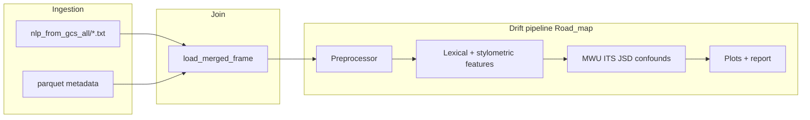

<!--
  Saved copy of the AI-induced linguistic drift plan (for later implementation).
  Paths in links are from the repository root. Cursor plan source: ai_drift_analysis_roadmap.
-->

# AI-induced linguistic drift / detection — adapted roadmap

## How this relates to [maks/Road_map.html](maks/Road_map.html)

The HTML roadmap assumes a greenfield corpus (`Document`: id, text, year, discipline, institution, `is_ai`), an optional **synthetic AI reference corpus**, and a linear `src/` pipeline. Your thesis already has:

- **Primary text:** `.txt` under `maks/data/nlp_from_gcs_all` — one file per extraction; join id = **filename stem prefix before first `_`**, matching `member_id_ss` ([`load_corpus_from_txt_dir` + `_txt_path_to_corpus_id`](maks/thesisdatarepo/analysis/io_data.py)).
- **Metadata:** parquet at [`data/data_analysis_files/df_filtered_final_96pct_grades_excl_2026_20042026.parquet`](data/data_analysis_files/df_filtered_final_96pct_grades_excl_2026_20042026.parquet) — **6,251 rows × 47 columns** (verified). Same core column names as before, plus **`num_authors`** and **`handin_month_num`** (see [data/data_analysis_files/README_df.md](data/data_analysis_files/README_df.md)). Still **no `abstract_ts`** — keep title-based abstract proxy.
- **Existing merge path:** [`load_merged_frame`](maks/thesisdatarepo/analysis/io_data.py) in [`maks/analysis_config.toml`](maks/analysis_config.toml) (`corpus_source = "txt_dir"`, `inner_join_metadata = true`).

The development plan below **reuses** this ingestion/merge layer, then layers the Road_map **feature → stats → viz → validation** work either under `maks/thesisdatarepo/…` or a dedicated `maks/drift_…` package (your choice when implementing), keeping grading out of model features per your instruction.



---

## Implementation todos

1. **doc-schema** — Define drift-pipeline row schema (id, text, year, department) from `load_merged_frame`; map abstract proxy to `MASTER THESIS TITLE`; strip `grading_*` from feature inputs.
2. **config-abstract** — Align `analysis_config` (or drift-specific TOML): `metadata_csv` → this parquet; `abstract` → **`MASTER THESIS TITLE`** (not `abstract_ts`). Optionally align [`maks/tests/test_nlp_metadata_coverage.py`](maks/tests/test_nlp_metadata_coverage.py) `METADATA_PARQUET`.
3. **phase2-features** — Preprocessor, lexical (MTLD / marker optional), stylometric with title–body Jaccard.
4. **phase3-stats** — MWU + FDR, ITS + HC3, JSD by year, confounds using `Department_new`.
5. **phase4-5-viz-validate** — Figures, `report.md`, robustness (cutoff, bootstrap, drop largest department).

---

## Parquet: what each column is for (and what we will use)

**Join / identity**

| Column | Role |
|--------|------|
| `member_id_ss` | **Primary join key** to corpus `id` when using `member_prefix` mode (matches `{member_id}_….txt`). |
| `primary_member_id_s` | Alternate member id from Solr/library; useful for sanity checks / dedup logic in tests ([`maks/tests/test_nlp_metadata_coverage.py`](maks/tests/test_nlp_metadata_coverage.py)). |
| `pdf_file` | PDF path/name; **stem** can align with full `.txt` stem when exports are named like the PDF (coverage test checks both stem and member prefix). |
| `ID` | Library/internal id string (not the merge key unless you configure `corpus_join`). |

**Time and “discipline / site”**

| Column | Role |
|--------|------|
| `Publication Year` | **Authoritative calendar year** for ITS cutoffs, pre/post-LLM splits, JSD-by-year, and any time axis. Do not take year from `handin_month`. |
| `Department_new` | **Department** = stand-in for “institution” / compositional confounds (chi-square stability, optional stratification). |

**Text metadata (no `abstract_ts` in this file)**

| Column | Role |
|--------|------|
| `MASTER THESIS TITLE` | **Short-text side for abstract–body Jaccard** (proxy for abstract vs tokens from full `.txt` body). |
| `Title` | Danish/other catalog title; optional secondary check; default analysis can prefer `MASTER THESIS TITLE`. |

**Bibliographic / authors**

| Column | Role |
|--------|------|
| `BY` | Author list (`;`-separated). |
| `SUPERVISED BY` | Supervisors. |
| `Author` | Solr author field; may duplicate `BY` semantics. |

**PDF-derived counts and content stats** (see [data/data_analysis_files/README_df.md](data/data_analysis_files/README_df.md))

- Structure: `num_tot_pages`, `num_cont_pages`, `handin_month`, `num_figures`, `num_tables`, `num_references`, `equation_count`
- **`handin_month`** — use **only for month** (seasonality / `handin_month_num`). Any year embedded in the string is **not** reliable for analysis; **always use `Publication Year`** for year.
- Content NLP from PDF pipeline (not the GCS `.txt`): `total_sentences`, `total_words`, `unique_words`, `avg_sentence_length`, `avg_word_length`, `lexical_diversity`
- Word counts variants: `num_words_full`, `num_words_cont`
- **`num_authors`** — inferred from `BY` (`;` count + 1); per README, missing → treat as single author.
- **`handin_month_num`** — numeric month (1–12) derived from `handin_month` only. **Year for all models and plots = `Publication Year` exclusively** — never infer year from `handin_month`.

Use these as **optional covariates** or for **sanity checks** vs features recomputed from `.txt` (they may disagree if extraction differs).

**Grading and meta (present on disk; excluded from drift models)**

- `grading_*` scores and `grading_meta_*`: **do not** enter Mann-Whitney / ITS / JSD feature matrices; optionally keep in a separate table for unrelated exploratory work.

**Other**

- `Timestamp` — ingest/export time.
- `pdf_sha256` — integrity id for PDF.

**Config when implementing:** Set `paths.metadata_csv` to `data/data_analysis_files/df_filtered_final_96pct_grades_excl_2026_20042026.parquet`. Point `abstract` to **`MASTER THESIS TITLE`** (or add a drift-only TOML).

---

## Phase mapping (Road_map → your repo)

### Phase 1 — Scaffolding and ingestion (mostly done)

- **Done in practice:** uv project, [`thesisdatarepo`](maks/thesisdatarepo/), TOML configs, GCS NLP CLI ([`maks/nlp_gcs.toml`](maks/nlp_gcs.toml)), merge + txt dir ([`io_data.py`](maks/thesisdatarepo/analysis/io_data.py)).
- **Remaining for drift work:** define a thin **`Document`** (or DataFrame schema) for the drift pipeline: `doc_id`, `text` (from merge), `year`, `discipline` ← `Department_new`, `institution` ← constant DTU or omitted, `is_ai` ← **unknown** (human corpus only unless you add a labelled subset).
- **Road_map “AI reference corpus generator”:** optional; only needed if you want **supervised** AI markers (G² vocabulary). Otherwise use **time-based** human-only drift (post-2022 shift) as in Phases 3–4.

### Phase 2 — Feature extraction (implement per Road_map tasks)

- **Preprocessor:** spaCy pipeline on `text_bucket` / merged `text`; strip references regex; output `ProcessedDoc`.
- **Vocab selector:** if no AI corpus, replace with (a) external AI list, (b) contrast two human eras (e.g. ≤2019 vs ≥2024), or (c) skip marker-rate feature.
- **Lexical + stylometric:** as in Road_map; **abstract–body overlap:** Jaccard(`MASTER THESIS TITLE` token set, body token set).
- **Feature matrix:** one row per merged thesis; **drop** all `grading_*` / `grading_meta_*` from modeling columns; keep `Publication Year`, `Department_new`, `member_id_ss`, etc.

### Phase 3 — Statistical analysis

- Cross-sectional split: e.g. **≤2021 vs ≥2023** on `Publication Year` (Road_map defaults). Dataset **excludes 2026** rows by construction — no action needed for that year in plots unless you swap file later.
- ITS: `post = (year > 2022)` etc.; **per-department robustness** matches “department_only” institution story.
- JSD: baseline pre-2019 vs yearly distributions from **lemma or token bags** on `.txt` bodies.
- **Confounds:** discipline/year chi-square on `Department_new` × year; topic filter on body text (AI keywords); **no** institution FE beyond department if single university.

### Phase 4 — Visualisation and report

- Reuse Road_map outputs: JSD line plot, significance table, ITS forest, generated `report.md` under something like `maks/data/drift_out/` (align with existing `analysis_out` or separate tree).

### Phase 5 — Validation

- Cutoff sensitivity (2021/2022/2023), bootstrap JSD, **drop largest department** instead of “largest institution” if that is the meaningful mass concentration at DTU.

---

## Text corpus location

- **Path:** `maks/data/nlp_from_gcs_all` ([`.gitignore`](.gitignore) lists it — large local-only data).
- **Naming:** `{member_id_ss}_{…}.txt` → corpus id = member id with `corpus_txt_id_mode = "member_prefix"` ([`maks/analysis_config.toml`](maks/analysis_config.toml) comment block).
- **Coverage:** [`maks/tests/test_nlp_metadata_coverage.py`](maks/tests/test_nlp_metadata_coverage.py) documents partial overlap between full folder and filtered parquet; expect orphans unless parquet is expanded or folder trimmed.

---

## Running the drift CLI (implemented)

From repo root, with `maks/data/nlp_from_gcs_all` populated and `maks/analysis_config.toml` paths valid:

```bash
uv sync
uv run thesis-drift run --config maks/analysis_config.toml
```

Optional: `--max-docs 100` for a quick smoke test. Outputs under `maks/data/analysis_out/drift/`:

- `drift_features.parquet` — regex + lexical (`feat_mtld`, `feat_hapax_ratio`, `feat_ttr`) + optional **spaCy** columns (`feat_spacy_*`: MTLD, TTR, hapax, sentence length mean/var, passive / hedge / connective rates)
- `drift_significance.csv` — Mann–Whitney (≤2021 vs ≥2023) + BH + Cohen’s d
- `jsd_by_year.csv` + `figures/jsd_drift.png` — vocabulary JSD vs pre-2019 baseline
- `its_results.csv` — interrupted time series (cutoff 2022), **HC3** robust SEs per feature

---

## Suggested first implementation milestone

1. **Document loader** that calls `load_merged_frame` with your TOML and emits a clean modeling frame (text + year + department + doc_id; **no grading columns**).
2. **Single end-to-end script:** preprocess subset (e.g. 100 docs) → one lexical + one stylometric metric → Mann-Whitney by year split → sanity CSV.
3. Expand to full Road_map feature set and plots.

---

## Optional later decisions (not blocking)

- **Thesis language** — English vs Danish/mixed affects spaCy model and word lists.
- **Marker vocabulary** — Era-only contrast vs optional synthetic/labelled AI slice for G²-style markers.
- **Month covariate** — Whether to add `handin_month_num` to ITS or keep v1 time-only.
